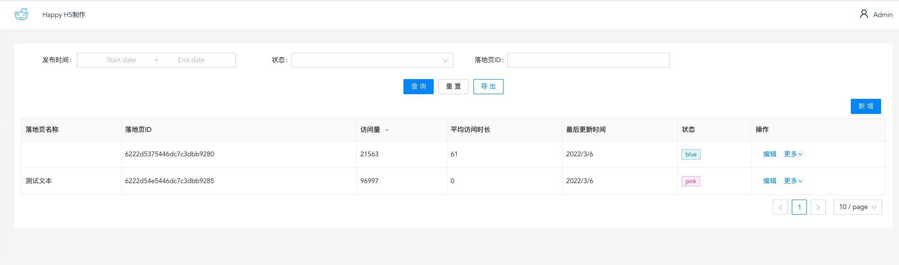
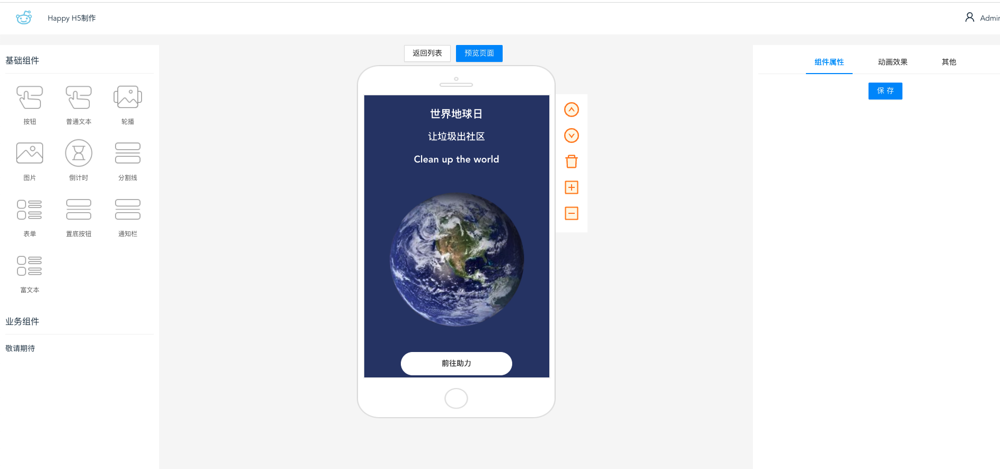
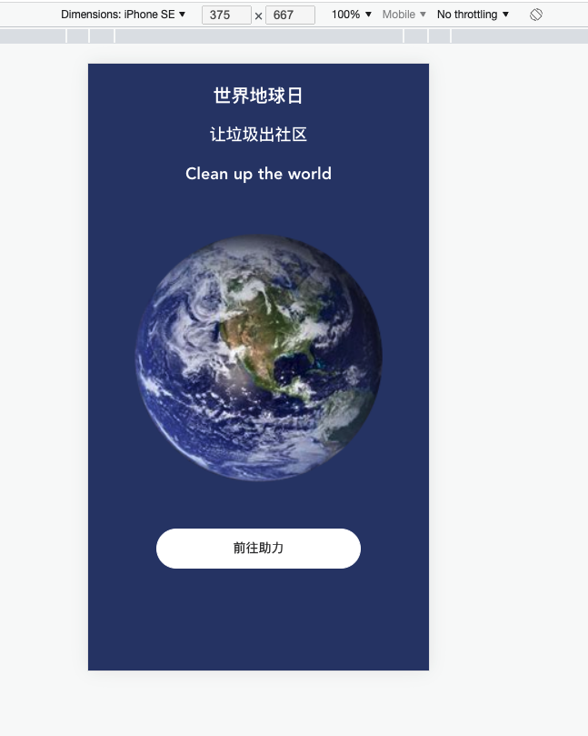

# happy-landing-page

## 项目介绍

  落地页搭建工具，采用流/层布局对页面模块进行排列；
  
  内含常用的组件，比如表单、图片、文本，按钮等组件；可对制作的页面进行预览，发布，数据埋点等操作；

## 技术栈介绍

  Vue3 + Ts + Ant-design-vue + Pinia + Vant + Egg(预期)

## 里程碑

### 版本v0.3（进行中）
  - 新增/修复功能
  - 版本计划
    - `feature: `实现事件总线，完成un、redo操作
    - `feature: `考虑是否增加用户模块
    - `feature: `增加二维码预览模式
    - `feature: `将主系统拆成主、预览两个页面模式，减少预览的白屏时间，减少不必要的资源加载
    - `fix: `解决体验过程中感觉不顺畅，可以优化的bug、问题等；
### 版本v0.2

  - 新增/修复功能
    - `feature: `块/定位布局模式
    - `feature: `图片管理模块，上传，选择图片等
    - `feature: `增加常用的组件，置顶、轮播、单行文本、多行文本、`富文本`等
    - `fix: `编辑时，第一次渲染点击可能导致组件坐标错位
    - `refactor/optimize: `统一数据流仓库
    - `refactor/optimize: `基于Vant UI组件，进行二次封装，方便功能扩展，开发（减少更改数据库数据的次数）
    - `feature: `提供设置宽高、边距的能力
### 版本v0.1

  - 新增/修复功能
    - `feature: `配置页面的生成，预览
    - `feature: `基本的交互，点击，跳转等

## 项目预览

## 开发记录

### `预览跟编辑器没有拆开导致的一些功能`

  - `描述`

    由于预览页面只是调用编辑器进行数据的显示，没有做数据、依赖隔离；先说这么做的理由：开发成本低，交互操作性高，不用考虑太多跨域，跨iframe的操作限制；缺点是：页面耦合在一起，一些场景需要额外编写代码，比如`置底组件`的fixed，由于都是同一个窗口，导致定位不准确等;

  - `解决`

    fiexed模拟，由于已知容器的高度，对fixed组件进行绝对定位，始终保持在容器的最底下

### `关于功能实现都写在了一块`

  - `描述`

    随着功能的开发，开发成本，难度也在逐渐增加，用户体验可能会变的不友好；在做表单控件处理的时候，有个功能是常见的下拉选择框，按理来说选项的增加也是直接坐在逻辑里面比较好，但是否有更好的方式，比如说我下拉只需要选一个选项组id，即绑定上了对应的选项组

  - `解决`

    将选项的功能拆分到另一个增删改查的模块当中去，通过id去关联，是否更优雅呢？当然，带来的问题是：需要用户提前在选项组模块中新建好选项，然后记住id，使用

### `关于move事件不流畅的几个原因`

  - `描述`

    move事件会穿透，当同级元素Amove到B元素上时，此时逻辑移动的元素变成了A，解决方案是当mousedown的时候，记录下生效的元素，此后处理函数的对象都是该元素；

  - `解决`

    move事件性能，采用事件委托，绑定在同一个父级上，判断下target，提升性能，提高用户体验；

### 参考文档
  - [Configuration Reference](https://cli.vuejs.org/config/).

    vue-cli配置管理

  - [动态表单引擎介绍](https://www.tangshuang.net/8149.html)

    `原子化组件虽然有通用性，任意业务场景都可以去配置，但是，配置的工作量实在太大了，没有什么意义。我推荐的，是一种业务组件的配置，根据自己的业务场景，把所有业务组件提炼出来，在每一个表单的可视化编辑界面，运营者们只需要做少量的工作去修改对应业务的参数。`

    一些思考：原子化组件的通用性，再加上一些定制化参数，其实就等于模板；当模板越来越多的时候，形成模板库，用户生产模板，用户使用模板，形成产品的闭环，生态也会趋于稳定发展的趋势？另，结合业务来看，开发一套动态表单并不难，无非是一串JSON，渲染这串JSON映射的组件，但业务场景来看，可并不单纯是填写表单，提交表单，通常还需要一些数据/表单之间的联动，比如某个标签下的用户只能领取特定优惠券；又或者是当A成立时，B表单控件才出现等等

  - [阿里巴巴Formily](https://github.com/alibaba/formily/blob/formily_next/README.md)
  - [H5-dooring](https://h5.dooring.cn/h5_plus)